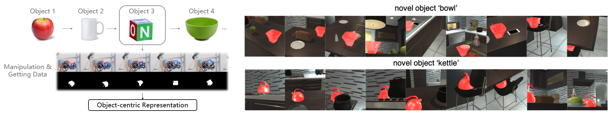

# Object Pursuit: Building a Space of Objects via Discriminative Weight Generation
<a href="https://pytorch.org/"></a> <a href="#"></a>
 

## Introduction

This is the official Pytorch implementation of **Object Pursuit**, proposed in the paper [Object Pursuit: Building a Space of Objects via Discriminative Weight Generation](https://arxiv.org/pdf/2112.07954.pdf).

Inspired by human infants and robots who learn object knowledge through continual interaction, we propose *Object Pursuit*, which continuously learns object-centric representations using training data collected from interactions with individual objects. Throughout learning, objects are streamed one by one in random order with unknown identities, and are associated with latent codes that can synthesize discriminative weights for each object through a convolutional hypernetwork.

Our code implements the following three parts proposed in our paper:

1. *Object Pursuit pipeline*, learning object-centric representation continually with re-identification, low-dimensional check, and forgetting prevention strategy. Code resides in `./object_pursuit` fold.
2. *Joint Training/Pretraining*, learning objects together and building low-dimensional object representation space at once. Pretraining is strongly recommended before *Object Pursuit*. Code resides in `./pretrain` fold. 
3. *One-shot Learning Application*, evaluating the usefulness of the learned object base representations to see how it helps learn a new object by one-shot and few-shot learning. Code resides in `./application/oneshot` fold. 

Also, you could find the implementation of the hypernetwork, the segmentation blocks, and latent representation in `./model/coeffnet`. It defines the following network structure:


## Getting Started

**Clone the repo:**

```bash
git clone https://github.com/pptrick/Object-Pursuit
cd Object-Pursuit
```

**Requirements**

- Python 3.7+ (numpy, Pillow, tqdm, matplotlib)
- Pytorch >= 1.6 (torch, torchvision)
- conda virtual environment is recommended, but optional

**dataset**(optional)

- iThor synthetic dataset: we collect synthetic data within the [iThor](https://ai2thor.allenai.org/ithor) environment, simulating a robot agent exploring the scene. The data collection code can be found in `data_collector`. Please organize your data into the following structure:

  ```
  <synthetic data root>
  │
  └─── <object 1>
  |    │
  |    └─── imgs
  |    │
  |    └─── masks
  └─── <object 2>    
  └─── <object 3>
  └─── ...
  ```

  Put rgb images in `imgs` and binary masks in `masks`. The names of corresponding images in `imgs` and `masks` should be the same. 

- DAVIS 2016 dataset: a video object segmentation dataset in the real scene. Download 'TrainVal' from [DAVIS 2016](https://davischallenge.org/davis2016/code.html). The DAVIS dataset has the following structure:

  ```
  <DAVIS root>
  │
  └─── Annotations
  └─── JPEGImages
  └─── ImageSets
  └─── README.md
  ```

- CO3D dataset: The CO3D dataset contains 18,619 videos of 50 MS-COCO categories, containing segmentation annotations. [Download](https://ai.facebook.com/datasets/co3d-downloads/). Please organize data into the following structure:

  ```
  <CO3D root>
  │
  └─── <category 1>
  |    └─── <object 1>
  |         └─── images
  |         └─── masks
  |         └─── ... (depth masks, depths, pointcloud.ply)
  |    └─── <object 2>
  |    └─── ...
  └─── <category 2>    
  └─── <category 3>
  └─── ...
  ```

- Youtube VOS dataset

- For custom dataset, we suggest you organize your data in the same way as 'iThor synthetic dataset'.

## Run Object Pursuit

To run object pursuit learning process from scratch:

```bash
# synthetic dataset
python main.py --dataset iThor --data <synthetic data root> --zs None --bases None --backbone None --hypernet None --use_backbone

# DAVIS dataset
python main.py --dataset DAVIS --data <DAVIS root> --zs None --bases None --backbone None --hypernet None --use_backbone
```

object pursuit based on pretrained hypernet and backbone:

```bash
# DAVIS dataset
python main.py --dataset DAVIS --data <DAVIS root> --zs None --bases None --backbone <path to backbone model .pth> --hypernet <path to hypernet model .pth> --use_backbone
```

- To generate the whole primary network's weights (backbone included) by hypernet, remove `--use_backbone` flag. This would change the hypernet's structure, so please keep this setting in other stages (evaluation, pretraining, one-shot learning).

- To set latent z's dimension, use `--z_dim <dim> `, default to 100.

- To set quality measure accuracy threshold $\tau$, use `--thres <threshold>`, default to 0.7.
- Use `--out <dir>` to set output directory. All checkpoints and log files will be stored in this directory.

To evaluate object pursuit, use `--eval`:

```bash
# DAVIS dataset
python main.py --dataset DAVIS --data <DAVIS root> --out <out dir> --use_backbone --eval
```

## Run Joint Pretraining

To run joint pretraining:

```bash
# DAVIS dataset
python joint_pretrain.py --dataset DAVIS --data <DAVIS root> --model Multinet --use_backbone --save_ckpt

# Multiple dataset
python joint_pretrain.py --dataset iThor DAVIS --data <synthetic data root> <DAVIS root> --model Multinet --use_backbone --save_ckpt
```

## Run One-shot Learning

To run and evaluate one-shot learning:

```bash
# DAVIS dataset
python one-shot.py --model coeffnet --dataset DAVIS --imgs <path to imgs> --masks <path to masks> --bases <path to bases> --backbone <path to backbone> --hypernet <path to hypernet> --use_backbone
```

- To view visualization results, use `--save_viz` flag.

We'll release the download link of the pretrained bases, backbone, and hypernet later.

## Citation

If you find our work useful to your research, please consider citing:

```latex
% todo: change this with formal ICLR citing
@article{pan2021object,
  title={Object Pursuit: Building a Space of Objects via Discriminative Weight Generation},
  author={Pan, Chuanyu and Yang, Yanchao and Mo, Kaichun and Duan, Yueqi and Guibas, Leonidas},
  journal={arXiv preprint arXiv:2112.07954},
  year={2021}
}
```

## License

This code and model are available for scientific research purposes as defined in the [LICENSE](https://github.com/pptrick/Object-Pursuit/blob/main/LICENSE) file. By downloading and using the code and model you agree to the terms in the [LICENSE](https://github.com/pptrick/Object-Pursuit/blob/main/LICENSE).